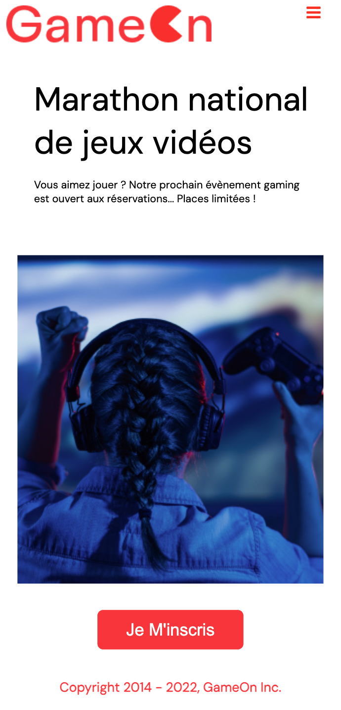
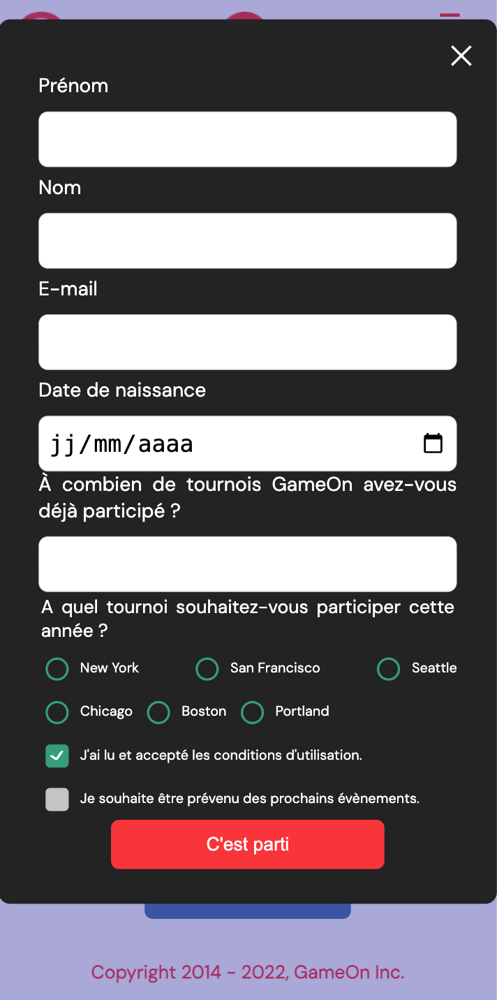

# GameOn – JavaScript Refactor & Skill Refresh

## 📸 Project Preview


This project is a **JavaScript skill refresh** based on the **GameOn** project (Project #4 – OpenClassrooms).


---

## 🌍 Live Demo
👉 https://gameonjacquesclermontdev.netlify.app/


---

## 🎯 Project Objectives

The goal of this work is not to redesign the application, but to:
- fully understand the original codebase,
- improve readability and maintainability,
- structure HTML, CSS, and JavaScript more clearly,
- keep a framework-free, vanilla JavaScript approach,
- document technical choices in a clean and pedagogical way.

## 🧱 Project Structure

```txt
.
├── README.md
├── docs
│   ├── Soutenance Projet IV.pdf
│   └── screenshots
│       ├── GameOn-desktop-modal.png
│       ├── GameOn-desktop.png
│       ├── GameOn-mobile-modal.png
│       └── GameOn-mobile.png
├── oc-p04-GameOn.code-workspace
└── src
    ├── assets
    │   ├── fonts
    │   │   └── DM_Sans
    │   │       ├── DMSans-Bold.ttf
    │   │       ├── DMSans-BoldItalic.ttf
    │   │       ├── DMSans-Italic.ttf
    │   │       ├── DMSans-Medium.ttf
    │   │       ├── DMSans-MediumItalic.ttf
    │   │       ├── DMSans-Regular.ttf
    │   │       └── OFL.txt
    │   └── img
    │       ├── bg_img.jpg
    │       └── logo.png
    ├── index.html
    ├── scripts
    │   └── modal.js
    └── styles
        └── modal.css
```
## 📸 Screenshots

| Desktop | Desktop-modal | Mobile | Mobile-modal |
|--------|---------|--------|--------|
|  |  |  | |

## 🚀 Getting Started

No installation is required.

### Run locally
1. Clone the repository
2. Open the project folder in **VS Code**
3. Open `index.html`:
   - using the **Live Server** extension (recommended)
   - or directly in your browser

---
### Main CSS Regions

- Reset & Variables
- Base / Layout / Typography
- Top Navigation
- Modal Overlay & Container
- Form Base
- Error UI
- Hero Section
- Footer
- Responsive
- Animations

### JavaScript Logic
The modal.js file handles the following responsibilities:

- responsive navigation (burger menu)
- modal open / close behavior
- form validation
- error message display
- confirmation message display

The file is structured into logical sections (navigation, modal handling, validation, submission) to keep the code readable and maintainable.

### Implement Features 
- Modal opening and closing
- Complete form validation:
  - first name and last name (minimum 2 characters)
  - valid email format
  - valid birthdate
  - number of tournaments
  - tournament selection
  - acceptance of terms and conditions
- Contextual error messages
- Confirmation message displayed after successful submission


## 🔮 Possible Improvements

- Validation logic factorization

- Unification of the error handling system

- Accessibility improvements

- Clearer separation of concerns in JavaScript

## 👤 Author

Originally submitted under alias **FanLubLou**, actual developer:

**Jacques Clermont** — Front-End Developer

## 📜 License

Educational and portfolio purpose only.
