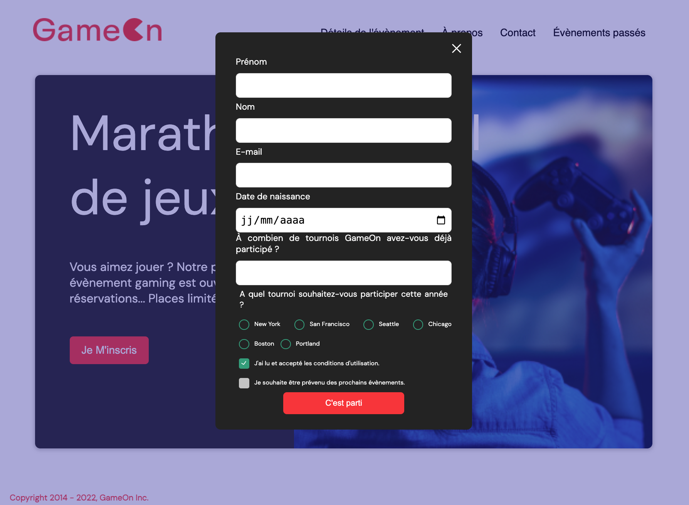

# GameOn – JavaScript Refactor & Skill Refresh

## 📸 Project Preview



This project is a **JavaScript skill refresh** based on the **GameOn** project (Project #4 – OpenClassrooms).

The goal of this work is not to redesign the application, but to:
- fully understand the original codebase,
- improve readability and maintainability,
- structure HTML, CSS, and JavaScript more clearly,
- keep a framework-free, vanilla JavaScript approach,
- document technical choices in a clean and pedagogical way.

---

## 🌍 Live Demo
👉 https://bookifanlublou.netlify.app/

[](https://app.netlify.com/sites/bookifanlublou/deploys)


---

## 🧱 Project Structure

```txt
.
├── README.md
├── docs
│   ├── Soutenance Projet IV.pdf
│   └── screenshots
│       ├── GameOn-desktop-modal.png
│       ├── GameOn-desktop.png
│       ├── GameOn-mobile-modal.png
│       └── GameOn-mobile.png
├── oc-p04-GameOn.code-workspace
└── src
    ├── assets
    │   ├── fonts
    │   │   └── DM_Sans
    │   │       ├── DMSans-Bold.ttf
    │   │       ├── DMSans-BoldItalic.ttf
    │   │       ├── DMSans-Italic.ttf
    │   │       ├── DMSans-Medium.ttf
    │   │       ├── DMSans-MediumItalic.ttf
    │   │       ├── DMSans-Regular.ttf
    │   │       └── OFL.txt
    │   └── img
    │       ├── bg_img.jpg
    │       └── logo.png
    ├── index.html
    ├── scripts
    │   └── modal.js
    └── styles
        └── modal.css
```
